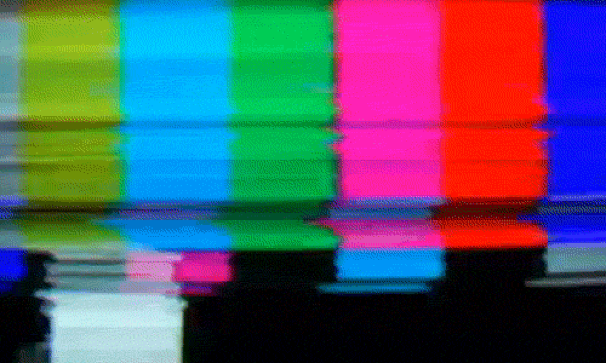

# Analysis of TV Viewing Habits

Group Members: Stephen Brescher, Sharice Cananady, Alison Sadel, Chandler Gibbons, Rizky Gamal

# OVERVIEW

* The dataset created and utilized for our analysis and visualizations are characterized by consumer television viewing trends and ratings. As a starting point, we web scraped Emmy nominations from 2016-2020 and used that dataset as an anchor point and calculated the nomination frequency filtered by title. From there, we merged viewing medium (channel), IMDB scores, Reel scores and Rotten Tomatoes scores.

# EXTRACT
* Technologies Used: pandas, beautifulSoup, splinter, collections, ChromedriverManager, warnings, requests, time, re, random, pprint, numpy, json, PIL, wordcloud, bootstrap, html/css, javascript, canvasjs

### Extraction Process

* Emmys Webscrape
    * For code see Project-2/Emmys_Folder/Emmys Scrape - 'year'
    * Source: https://www.vanityfair.com/hollywood
* Ratings Webscrape 
    * For code see Project-2/platforms_webscrape/'channel_scrape'
    * Source: https://reelgood.com/
* Channels
    * Manually verified
    * Source: https://www.emmys.com/

### Data Limitations & Future Considerations
* The Emmys Webscrape was touted as 'a full list' on Vanity Fair but was actually only a selection of award categories centered around actors writers or directors (telecast) and left out a lot of the behind-the-scenes creative arts awards categories caentered around design, costume, make-up, sound mixing, visual effects etc. Those features absolutely contribute to the full asethetic of a television program so our dataset may not fully convey some shows full number of nominations. 
* We have one field in our dataset called, 'channel,' which refers to the network that emmys.com attributed the shows origin to. While we used that as our beacon of truth, many of the programs live on multiple streaming networks. Many of the popular shows may have premiered on FX but have since been swallowed up by larger networks so any analysis comparing network content may be difficult based on the overlapping family trees.
* As a future consideration, it may be interesting to use this dataset as a foundation to explore consolidation of tv networks and the competitive landscape, looking at subscriber and financial data.

# Transform
* During the webscrape, some titles were returned missing characters or the exact spelling, punctuation and capitalization varied.
    * Used value_counts in both title and awards fields to identify duplicity and spelling differences
    * Used .replace to merge duplicative awards categories
        * ex: Directing for a Comedy merged with Directing for a Comedy Series
    * Removed all commas using .replace(',','', regex=True)
    * Lowercased all titles using .str.lower( )
    * Removed additional punctuation using .map(lambda x: x.lstrip('+-').rstrip('.'))
    * Used .str.contains( ) to merge nearly identical titles
* Merging
    * Used .map( ) function to append a dataFrame of channels to the larger dataFrame
    * Used .rename( ) function for future merging and SQL querying
    * Dropped secondary Indexes by using df.drop(df.filter(regex="Unname"),axis=1, inplace=True)
* Plotting considerations
    * In advance of creating a horizontal bar chart to display number of emmy nominations, IMDb score and Rotten Tomatoes score, we recognized that Rotten Tomatoes was on a 1-100 scale which displayed next to IMDb's 1-10 scale, the plot would be distorted so we decided to proactively convert Rotten Tomatoes column from % to float and make score out of 10 for future plotting using the below:

    s = df['Rotten_Tomatoes'].str.replace(r'%', r'').astype('float')/100
    df['Rotten_Tomatoes']  = pd.to_numeric(df['Rotten_Tomatoes'], errors='coerce').fillna(s)
    df['Rotten_Tomatoes'] = df['Rotten_Tomatoes'] * 10
    

### Flask Installation
* After loading our clean csv's into SQL, we needed a medium to display our website and visualizations. Creating a Flask app allowed us to query the SQL server and display results in a DataFrame that could then be parsed into JSON to help create interactive visualizations using Plotly.
* For files see:
    * Clean Data:
        * CSVs/CSVs_for_SQL
    * Queries:
        * SQL queries
    * Tester File: 
        * flask_test

### Schema - ERD Diagram

# Plotting 
### IMDb, Rotten Tomato & Emmy Nominations by Title & Channel
* In order to plot to create an interactive visualization displaying all titles nominated for emmys with a dropdown to filter by channel, we opted to filter within Postgres. We created a query using multiple WHERE statements. We opted to only display as drop down options channels that had 5 or more emmy nominations from 2016-2020 (HBO, Netflix, NBC, FX, Hulu, CBS, ABC, Showtime, Amazon Studios, Fox).
* We created the visualization using d3 and used Javascript For Each Loops and then pushed values based on index number into containers to extract and create traces for plotting.

### Wordcloud

* The code used to produce the wordcloud determines the size of each streaming program title by recognizing the frequency in which a specific title is mentioned as an Emmy’s nomination. The number of emmy nominations is being used as an indicator of popularity and quality. The Python wordcloud library was used to build the visualization. An initial challenge is that wordcloud normally counts the distribution of individual words rather then parsing the string whole. That would contribute to a distorted image with 3,004 individual words being reviewed. To leverage the full title in image generation ‘Counter’ was imported from the collections library and I was able to call the .generate_from_frequencies( ) method. 
* The wordcloud provides a powerful visual representation of viewing patterns from 2016 to 2020. Ask yourself, do your personal viewing habits mirror the top titles here?

